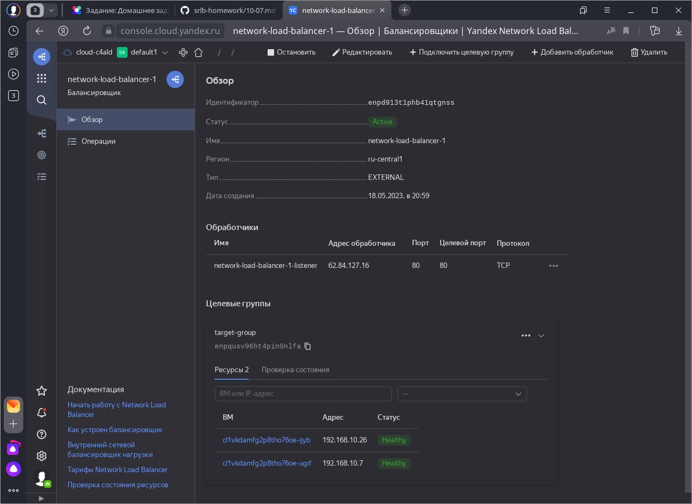
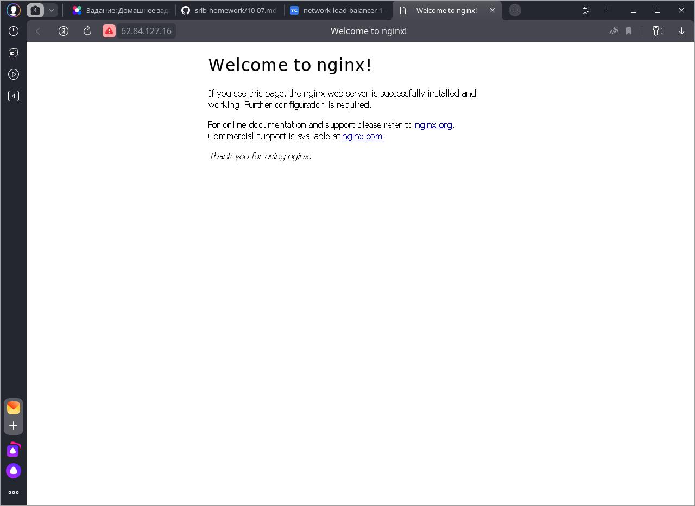

# Домашнее задание к занятию "`10.7 «Отказоустойчивость в облаке»`" - `Дьяконов Алексей`

### Задание 1.  Создание таргет-группы и сетевого балансировщика в Yandex Cloud.

1. `Terraform Playbook`

-  [main.tf](./config/main.tf)

2. `Скриншот статуса балансировщика и целевой группы`

-

3. `Скриншот страницы, которая открылась при запросе IP-адреса балансировщика`

-

### Задание 2.  Создание группы виртуальных машин с балансировщиком нагрузки в Yandex Cloud.

1. `Terraform Playbook`

-  [main2.tf](./config/main2.tf)

`Установка nginx`

-  [nginx2.yaml](./config/nginx2.yaml)

2. `Скриншот статуса балансировщика и целевой группы`

-

3. `Скриншот страницы, которая открылась при запросе IP-адреса балансировщика`

-

