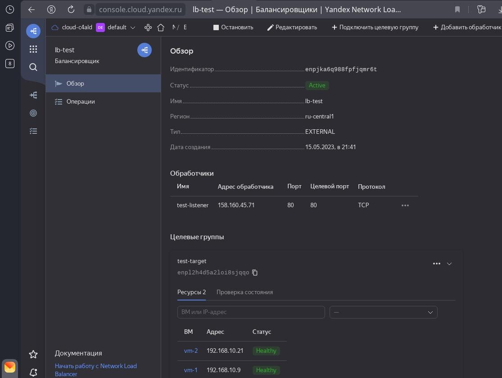
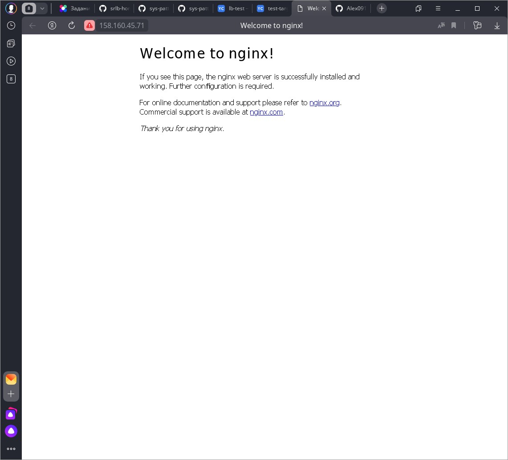

# Домашнее задание к занятию "`10.7 «Отказоустойчивость в облаке»`" - `Дьяконов Алексей`

### Задание 1.  Создание таргет-группы и сетевого балансировщика в Yandex Cloud.

1. `Terraform Playbook`

-  [main.tf](./config/main.tf)

2. `Скриншот статуса балансировщика и целевой группы`

-

3. `Скриншот страницы, которая открылась при запросе IP-адреса балансировщика`

-

